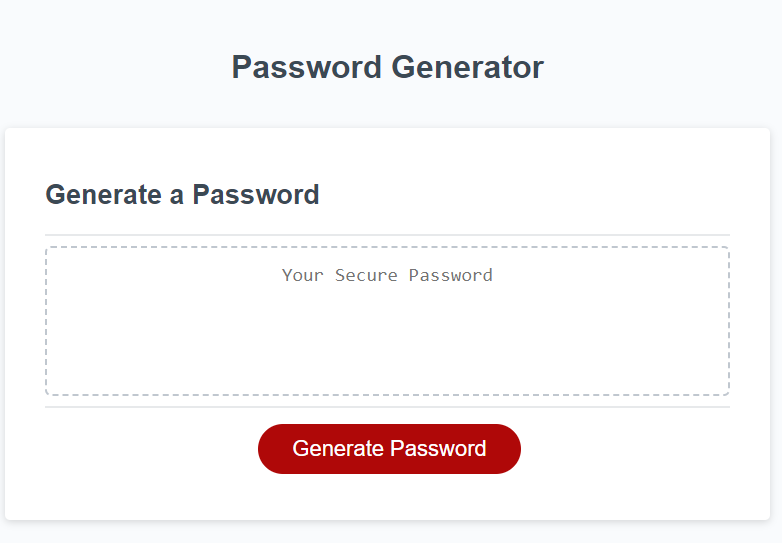
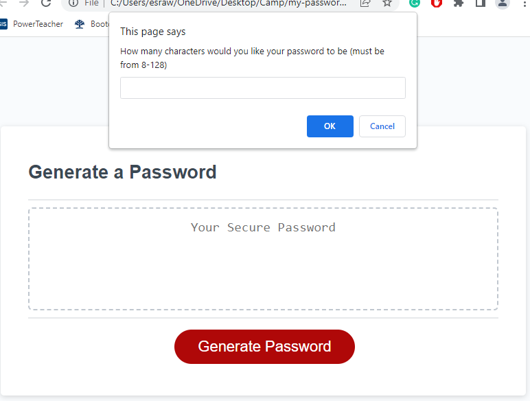
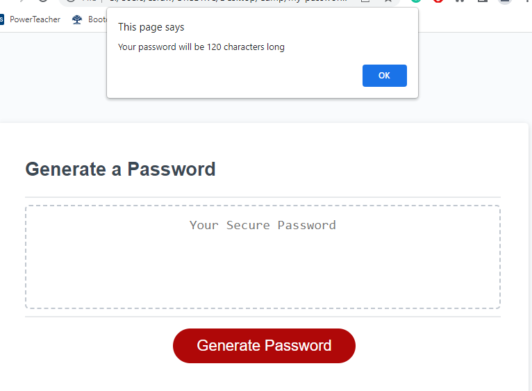
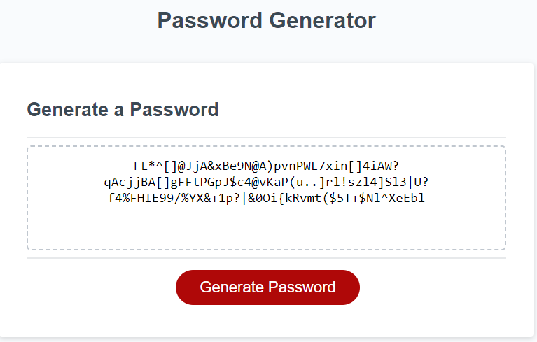

# Password Generator

## Description
This randomized pass-word generator has been created to provide a strong pass-word for users. To accomplish this, users are given a prompt to choose the pass-word character length of minimum 8 characters, and a maximum of 128.

Users are then asked to select at least one of the following character options: a capital letter, a lower-case letter, a number, and a special character/symbol. If the user selects none, they are alerted of the minimal requierment and must click the "Generate Password" button again.
## features
- pass-word generation of minimum 8 characters and maximum 128 characters.
- Include capital letters.
- Includes lower-case letters.
- Includes numbers.
- Includes special characters.
## Technologies Used
- HTML: to display page and page strucute.
- CSS: to style the pass-word generator.
- javaScript: to generate pass-word generator functionality.

## Deployed Application

### Image 1

### Image 2

### Image 3

### Image 4

